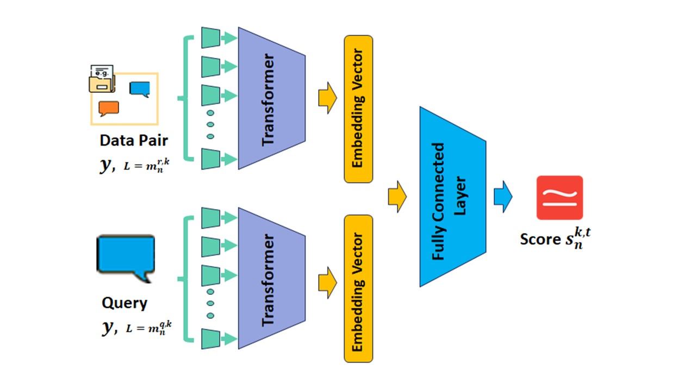
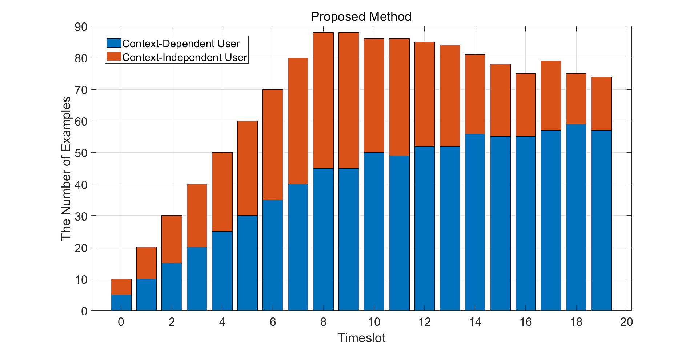
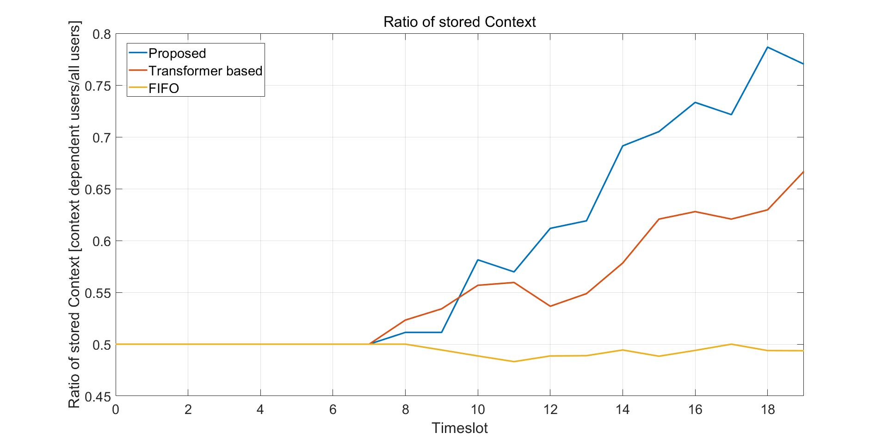

# SpaceRIS: LEO Satellite Coverage Maximization in 6G Sub-THz Networks by MAPPO DRL

## Overview
First, we use the Sentence transformer to extract the embedding vectors for the user pair and current prompt, respectively, by running them through the transformer before scoring. Let the input sentence is y, then this sentence is defined as:
y=[ω_1,…,ω_L],	(8)
Where ω_i is the i-th character of the sentence and L∈{m_n^(r,  k),m_n^(q,k)} is the length of the sentence. The sentence is then fed into the Transformer and mapped to an embedding vector as follows:
y'=[〖ω'〗_1,…,〖ω'〗_(L^T )],	(9)
Where 〖ω'〗_i∈R and L^t is the length of the embedding vector for a sentence which has a fixed length for any input. After encoding, the two embeddings are merged and passed through a fully connected neural network layer. It determines whether the input prompt is contextually relevant to the data and trains like a binary classifier. The result is a similarity score that quantifies this relevance. The fully connected neural network layer was trained on a dataset comprising 4 million instances from a Reddit conversation dataset. Each data point consists of a pair conversation (two turns of dialogue) and a subsequent prompt (the final turn in the conversation). The training labeled the data with a '1' if the prompt was contextually relevant to the conversations, and '0' if it was not. The architecture of the overall scoring algorithm is shown in the following figure:

## Results:

## Version
- python 3.8
- Pytorch 2.0.0

## Acknowledgement
이 성과는 2023년도 정부(과학기술정보통신부)의 재원으로 정보통신기획평가원의 지원(No.2019-0-01287-005, 분산 엣지를 위한 진화형 딥러닝 모델생성 플랫폼)과 2023년도 정부(과학기술정보통신부)의 재원으로 정보통신기획평가원의 지원을 받아 수행됨(No.RS-2022-00155911, 인공지능융합혁신인재양성(경희대학교))

## License
Copyright (c) 2023 Networking Intelligence
Redistribution and use in source and binary forms, with or without modification, are permitted provided that the following conditions are met:

1. Redistributions of source code must retain the above copyright notice, this list of conditions and the following disclaimer.

2. Redistributions in binary form must reproduce the above copyright notice, this list of conditions and the following disclaimer in the documentation and/or other materials provided with the distribution.

THIS SOFTWARE IS PROVIDED BY THE COPYRIGHT HOLDERS AND CONTRIBUTORS "AS IS" AND ANY EXPRESS OR IMPLIED WARRANTIES, INCLUDING, BUT NOT LIMITED TO, THE IMPLIED WARRANTIES OF MERCHANTABILITY AND FITNESS FOR A PARTICULAR PURPOSE ARE DISCLAIMED. IN NO EVENT SHALL THE COPYRIGHT HOLDER OR CONTRIBUTORS BE LIABLE FOR ANY DIRECT, INDIRECT, INCIDENTAL, SPECIAL, EXEMPLARY, OR CONSEQUENTIAL DAMAGES (INCLUDING, BUT NOT LIMITED TO, PROCUREMENT OF SUBSTITUTE GOODS OR SERVICES; LOSS OF USE, DATA, OR PROFITS; OR BUSINESS INTERRUPTION) HOWEVER CAUSED AND ON ANY THEORY OF LIABILITY, WHETHER IN CONTRACT, STRICT LIABILITY, OR TORT (INCLUDING NEGLIGENCE OR OTHERWISE) ARISING IN ANY WAY OUT OF THE USE OF THIS SOFTWARE, EVEN IF ADVISED OF THE POSSIBILITY OF SUCH DAMAGE.
